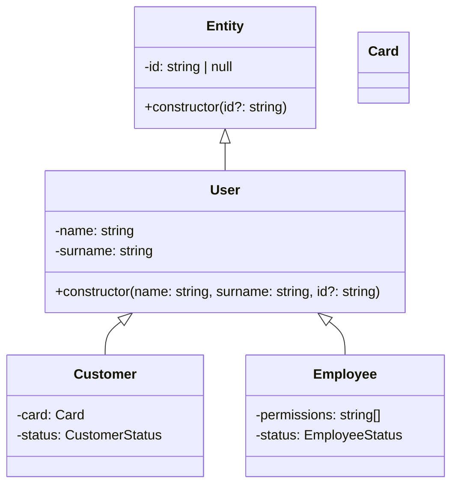

# Klasy

```mermaid
classDiagram
    class Entity {
        -id: string | null
        +constructor(id?: string)
    }

    class User {
        -name: string
        -surname: string
        +constructor(name: string, surname: string, id?: string)
    }

    class Customer {
        -card: Card
        -status: CustomerStatus
    }

    class Employee {
        -permissions: string[]
        -status: EmployeeStatus
    }

    class Card {
    }


    Entity <|-- User
    User <|-- Customer
    User <|-- Employee
```
